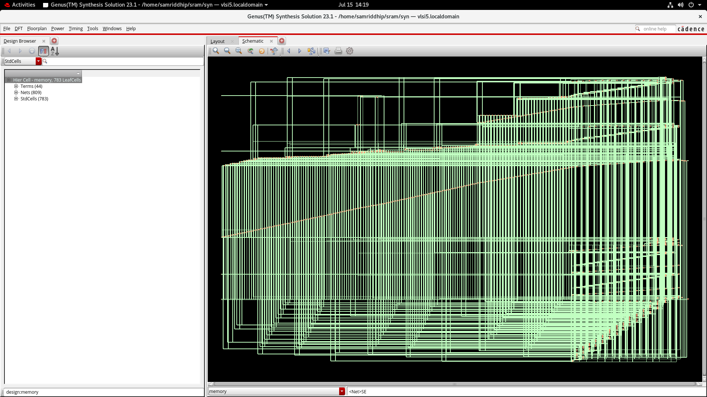
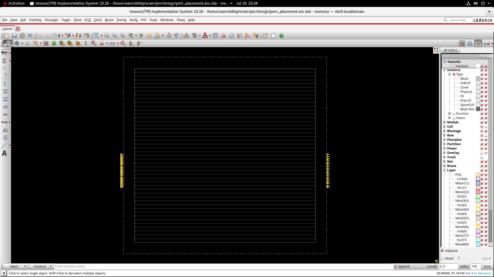
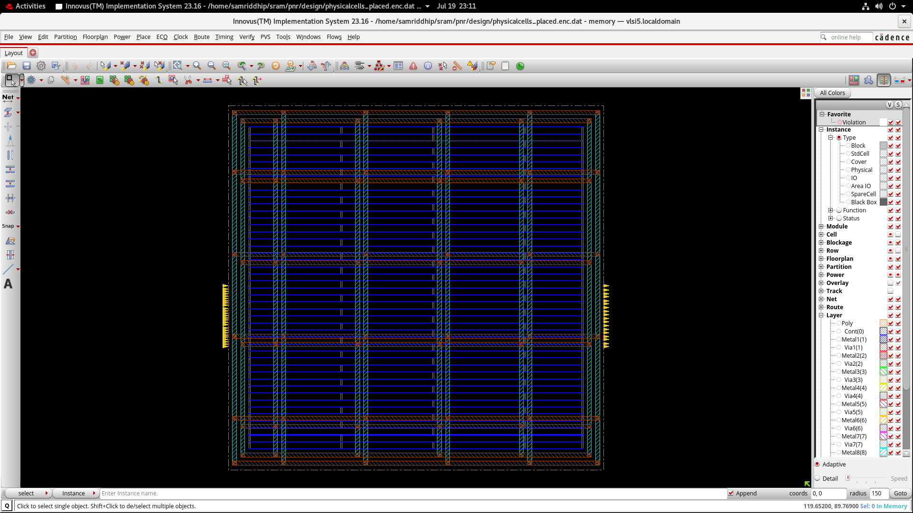
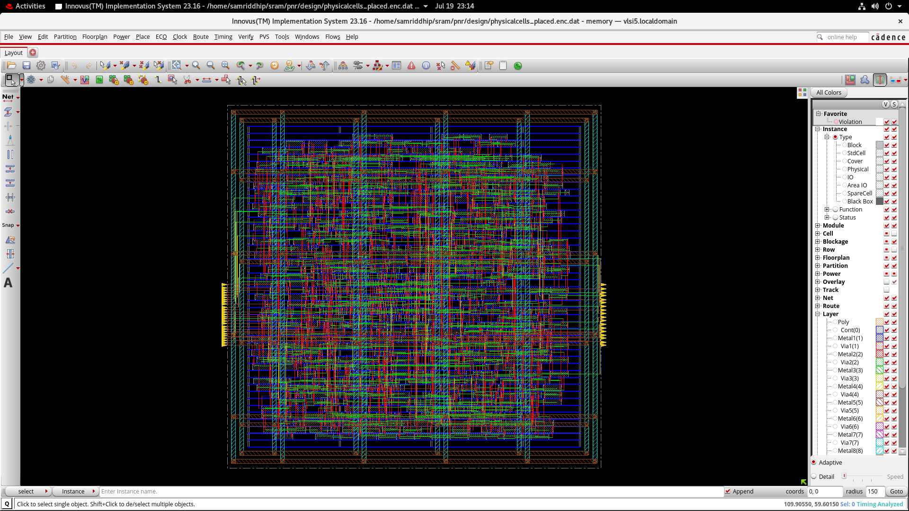
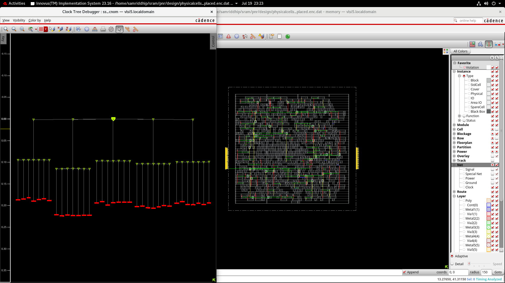
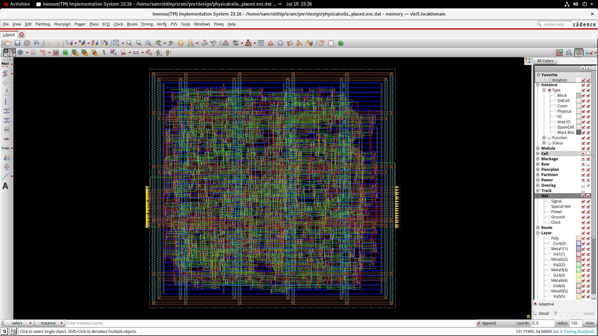

<div align="center">

# 🧠 SRAM
### A Memory Block, Made Testable — RTL to a Tapeout-Ready GDSII

**Built during a Physical Design Internship at VLSIMINDS · Cadence Innovus 23.16 · GPDK045 (45nm) · June–July 2026**


-blue)


</div>

---

## 🚀 The 30-Second Pitch

A memory that can't be tested after it's fabricated is a memory you have to trust blindly. `SRAM` is the opposite of that — every one of its 256 bits can be shifted in, shifted out, and checked from the outside world before the chip ever leaves the fab, because the design carries its own scan chain from RTL through to GDSII.

This repository documents the complete physical design closure of `memory` — a 16-word × 16-bit synchronous register-file block with full scan-based DFT — built on Cadence's **GPDK045 (45nm)** process during a hands-on internship at VLSIMINDS. Every screenshot and report here is a real Innovus artifact from the actual build: floorplan to final signed-off layout.

> **Why it matters:** DFT isn't free. Every scan flop you insert adds area, every scan net you route competes with real signal nets for space, and if the scan chain's own timing isn't closed, the chain that's supposed to test your chip becomes the first thing that fails on it. This design closes **both** — functional timing *and* scan timing — with **0 hold violations** and **100% legal pin placement**, and ships a real, verifiable `final.gds`.

---

## 🧩 What's Actually Inside `memory`

```
                    ┌───────────────────────────────────┐
                    │              memory                 │
                    │   44 top-level pins · 809 nets      │
                    └───────────────┬─────────────────────┘
        ┌──────────────┬────────────┼────────────┬──────────────┐
        ▼              ▼            ▼            ▼              ▼
    clk_i / reset_i  addr_i[3:0]  wdata_i[15:0]  wr_rd_i     scan_in / SE
        │              │            │                             │
        └──────────────┴─────┬──────┴─────────────────────────────┘
                              ▼
                    16 × 16-bit register bank
                    mem[0] … mem[15]  (SDFFQX1LVT scan flops)
                              │
                    ┌─────────┴─────────┐
                    ▼                   ▼
              rdata_o[15:0]         ready_o
                    │
              scan_out  (1 scan chain, scan_in → scan_out)
```

- A **16-deep × 16-bit synchronous memory** — read/write addressed over `addr_i[3:0]`, data in on `wdata_i[15:0]`, data out on `rdata_o[15:0]`
- **783 standard-cell instances** across **16 unique LVT/HVT cell types** — SDFF scan flops, NAND/NOR/AOI/OAI logic, all from a low-power library
- **1 full-chip scan chain** stitched through every sequential element — `scan_in` in, `scan_out` out, gated by `SE`
- Dual-clock timing: **`mclk`** for the functional path, **`vclk`** as the I/O reference clock, both closed at a **3.5 ns** period
- Built on **GPDK045**, Cadence's generic 45nm PDK, verified across **slow** and **fast** library corners (`ss_cnom`, `fast_cnom`)

---

## 🎬 The Build, Stage by Stage

Every stage below is backed by a live Innovus screenshot from the actual `.enc.dat` checkpoint saved after that step.

### 1 · Synthesis Hand-off — Genus → Innovus
`memory` arrives from Cadence Genus as a gate-level netlist: **783 leaf cells**, **809 nets**, **44 top-level terminals** — small enough to see the entire schematic fan out in one view.



*Design Browser confirming the synthesized hierarchy — 783 LeafCells, 809 Nets, 44 Terms — before placement begins.*

### 2 · Port Placement
I/O pins land on the floorplan edges first. With only 44 pins to place, the priority here is keeping every pin legally on-grid — a check this design passes with a perfect score later on.



*Early floorplan: standard-cell rows laid out, ports staged along both edges.*

### 3 · Placement & Power Grid
Standard cells legalize into rows and the power mesh goes down across the core — VDD/VSS straps feeding every row before a single signal net is routed.



*Cells placed, power grid complete — the calm, structured state just before routing begins.*

### 4 · Routing In Progress
Signal nets start threading through the design — the first real look at how 809 nets compete for space across the metal stack.



*Routing underway: signal, clock, and scan nets all weaving through the same fabric.*

### 5 · Clock Tree Debug
Before signoff, the clock tree gets inspected directly — this is Innovus's Clock Tree Debugger, showing the buffer tree fanning out from `mclk` to every leaf-level scan flop, side-by-side with the physical layout.



*Every branch of the clock tree checked for balance before hold signoff — this is what makes a ~0 ps worst-slack result possible.*

### 6 · Final Routed Layout
Fully routed, fully optimized. This is the design as it enters signoff — every net closed, every scan flop reachable, every pin legal.



*The finished layout — dense, fully routed, ready for the GDSII handoff.*

---

## 🔬 Verification: Does It Actually Hold Up?

### Pin Assignment — `checkPinAssignment`

| Partition | Pads | Pins | Legal | Illegal | Unplaced |
|---|---|---|---|---|---|
| `memory` | 0 | 44 | **44** | 0 | 0 |

**100% of pins legally assigned** — no illegal, no internal-illegal, no unplaced. A clean pin check like this early in the flow is what keeps port-related DRC surprises from showing up three stages later.

### Timing Constraints — from `memory_sdc_dft.sdc`

| Constraint | Value |
|---|---|
| Functional clock (`mclk`) | 3.5 ns period |
| I/O reference clock (`vclk`) | 3.5 ns period |
| Setup/hold clock uncertainty | 0.4 ns (both `mclk` and `vclk`) |
| I/O delay (all ports) | 1.0 ns, referenced to `vclk` |
| Driving cell (inputs) | `BUFX12`, `slow_vdd1v0` library |
| False paths | `scan_in`, `SE` (DFT-only signals, excluded from functional timing) |

### DFT — Scan Chain Integrity

Confirmed directly from the ScanDEF: **1 scan chain**, starting at `scan_in`, terminating at `scan_out` — every sequential element in the design stitched into a single controllable, observable shift path.

### Hold Timing — reg2reg, post-route

Sampling the worst reg2reg paths from the post-route hold report:

| Path | Endpoint | Slack |
|---|---|---|
| 1 | `rdata_o_reg[9]/CK` | ~0.000 ns (borderline, effectively met) |
| 2–10 | `mem_reg[*][*]/CK`, `rdata_o_reg[7]/CK` | 0.000 – 0.003 ns, **all MET** |

Hold is the check that exposes an unbalanced clock tree fastest — a race-through on even one scan flop can corrupt a shift operation before the chip is ever powered up for functional test. Landing at **~0 ps worst slack with zero violations** confirms the clock tree (visualized in the Clock Tree Debugger above) stayed balanced all the way through detail routing.

### Final Deliverable — `final.gds`

A complete, verified GDSII stream-out — the design library `DesignLib`, fully placed, routed, and ready to hand off downstream.

---

## 📊 The Numbers That Matter

| Metric | Value |
|---|---|
| Design | `memory` |
| Interface | `clk_i`, `reset_i`, `valid_i`, `addr_i[3:0]`, `wdata_i[15:0]`, `rdata_o[15:0]`, `wr_rd_i`, `ready_o` |
| Standard-cell instances | 783 |
| Unique cell types | 16 (LVT/HVT) |
| Nets | 809 |
| Top-level pins | 44 (100% legally assigned) |
| Process | GPDK045 (45nm) |
| Functional clock | `mclk`, 3.5 ns period |
| Scan chains | 1 (`scan_in` → `scan_out`) |
| Post-route reg2reg hold slack | ~0 ps, no violations |
| Final deliverable | `final.gds`, signed off |

---

## 📁 Repository Structure

```
SRAM-Physical-Design/
├── README.md                          ← you are here
├── screenshots/
│   ├── 01_synthesis_design_browser.png
│   ├── 02_port_placement.png
│   ├── 03_placement_power_grid.png
│   ├── 04_routing_in_progress.png
│   ├── 05_clock_tree_debugger.png
│   └── 06_final_routed_layout.png
├── reports/
│   ├── pin_check.txt                  ← checkPinAssignment
│   ├── route_hold_reg2reg_hold.tarpt  ← post-route hold timing report
│   ├── memory_cell.list               ← checkDesign cell list (timing library)
│   └── memory_main.ascii              ← design summary
├── netlist/
│   ├── memory_netlist_dft.v           ← gate-level netlist, DFT-inserted
│   ├── memory_sdc_dft.sdc             ← timing constraints (DFT mode)
│   ├── memory_scanDEF.scandef         ← scan chain definition
│   ├── Default.view                   ← MMMC view (corners, libraries)
│   └── Default.globals                ← Innovus global settings
└── gds/
    └── final.gds                      ← final signed-off GDSII
```

---

## 🛠️ Tools & Flow

| Stage | Tool |
|---|---|
| Logic Synthesis | Cadence Genus 23.14 |
| Floorplan / Placement / Power / CTS / Routing | Cadence Innovus 23.16 |
| DFT Scan Insertion | Scan-chain stitched pre-placement, verified via ScanDEF |
| Technology | GPDK045 (45nm), `slow_vdd1v0` / `fast_vdd1v0` basic-cell libraries (regular/HVT/LVT) |

---

## 🙋 About This Build

Completed during a **1-month Physical Design internship at VLSIMINDS** (June–July 2026), working hands-on in Cadence Innovus across the full back-end flow — from port placement through power planning, standard-cell placement, clock tree synthesis, routing, and DFT-aware timing signoff.

**Samriddhi Purohit** · B.Tech Electronics & Instrumentation Engineering, SGSITS Indore
📧 samriddhipurohit10@gmail.com · [LinkedIn](https://linkedin.com/in/samriddhi-purohit-837a27316) · [GitHub](https://github.com/samriddhipurohit10)
